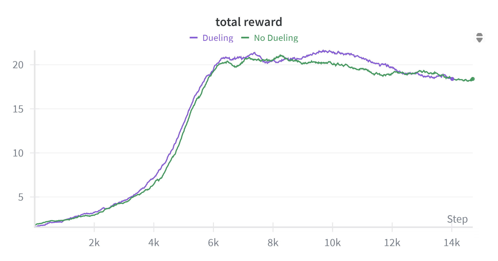
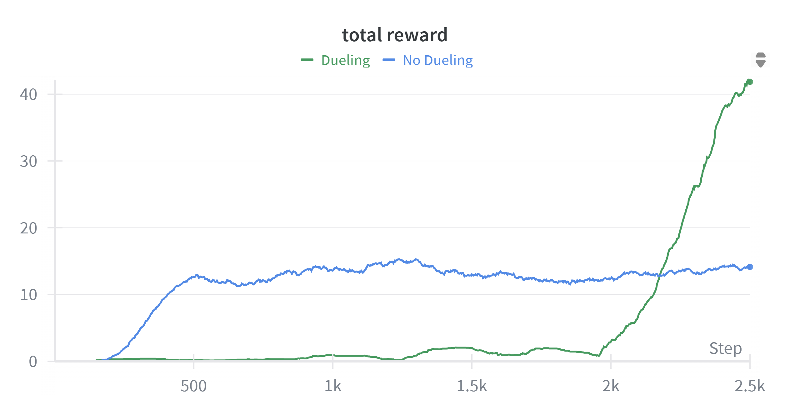

# Dueling Double Q-Learning

Recently, I needed to implement a Dueling Double Q-learning Agent and
decided to write a short guide that walks through the concepts, need and
details of this implementation.

The overall problem is about sequential decision making where an agent
interacts with an environment and learns to maximize cumulative reward
in the environment. A formal description of the problem (a framework called MDP) includes
a state space, an action space, reward function, transition function of
the environment. Q-learning is one method that helps to achieve part of
this goal when an agent is in a discrete action space. The key idea of
this algorithm is to capture how good it is to be in a state and take a
particular action and use such a function to take an action in a given state that maximizes this
value.

If $Q(s_t, a_t)$ captures this value for a state-action pair, a general
update for a state-action pair at time t is given as follows (Eq 6.8
\[1\]):
$$Q(s_t, a_t) \leftarrow Q(s_t, a_t) + \alpha \left[ r_{t+1} + \gamma \max_{a'} Q\left(s_{t+1}, a'\right) - Q(s_t, a_t) \right]$$
Although one selects an action that maximizes the Q-value, using the
maximum of an estimate for an estimate of the maximum value leads to
a positive bias. To solve this problem of maximization bias, another algorithm
called the Double DQN with two separate Q-tables uses the following update for improved stability.

$$Q_1(s_t, a_t) \leftarrow Q_1(s_t, a_t) + \alpha \left[ r_{t+1} + \gamma Q_2\left(s_{t+1}, \arg\max_{a} Q_1(s_{t+1}, a)\right) - Q_1(s_t, a_t) \right]$$

Q-learning or Double Q-learning can be used in the tabular case when the
environment is small. But as the size of the environment, state space
and action space increases, function approximators like deep networks
come handy to generalize learning over the state and action space. The function
approximator usually outputs the Q-value of a state-action pair. This value captures
the return by learning from a series of episodes of
environment interactions. Deep Networks help scale learning to large
MDPs. In this article, I discuss the benefits of using a specific
architecture called a Dueling Network with Double Q-Learning and show
its performance for two Atari games.

Let's look what is the overall idea of this network. For Atari games,
the input is processed through a CNN as it consists of frames of visual data. Instead of outputting the Q-value
for each state and action pair, the output from CNN is split into two
streams. One of these outputs the Value of a state, $V(s)$ and the other
outputs the Advantage of taking an action in that state, $A(s,a)$. The
expected value of this Advantage function is zero. This can be included
by adding the mean value as an regularization to help the stability.

$$A(s, a) = Q(s, a) - V(s)$$
$$\mathbf{E}_{a \sim \pi(a|s)}[A(s, a)] = 0$$

$$Q(s, a) = V(s) + \left( A(s, a) - \frac{1}{|\mathcal{A}|} \sum_{a'} A(s, a') \right)$$
The original paper on Dueling Network Architectures \[2\] suggests the
following update for Q-function for the optimal policy.
$$Q(s, a) = V(s) + \left( A(s, a) - \max_{a'} A(s, a') \right)$$ For the
implementations as a part of this article, I have used the first update
for more stable learning.

## Implementation Details

I used an initial Sequential Block consisting of 3 CNN layers followed
by two linear layers with 512 hidden number of units for the Value
function and Q-Value Function stream. The results show a comparison of a
Deep DQN with a Dueling DQN over 6 million environment interactions for
Breakout and Enduro.

The choice of these two games is intentional. Dueling does not impact
the performance of the agent in Breakout. This is shown in the first image. The authors of the original paper on
Dueling Networks \[1\] point out that the benefit of using dueling
network increases with large action space over using single stream of
state-action function. It is intuitive to expect better estimates of the
state functions with more frequent updates coming for state-action
pairs. This is evident in the performance with Dueling for Enduro in the second image.

## References

1. Sutton, R. S., & Barto, A. G. (2018). Reinforcement learning: An introduction (2nd ed.). MIT Press.
2. Wang, Z., Schaul, T., Hessel, M., Van Hasselt, H., Lanctot, M., & De Freitas, N. (2016). Dueling network architectures for deep reinforcement learning. In International Conference on Machine Learning (ICML) (pp. 1995–2003).

<small> Author Note

Feel free to reach out if you:

1\. Have any questions or get stuck implementing the ideas discussed in
this article - I'm happy to help.

2\. Are a student seeking guidance on topics related to school,
research, or reinforcement learning - I welcome your questions and will
do my best to answer them.

3\. Use of generative AI: No other part of this article was generated
using generative AI tools, except for this author note (:P). </small>
